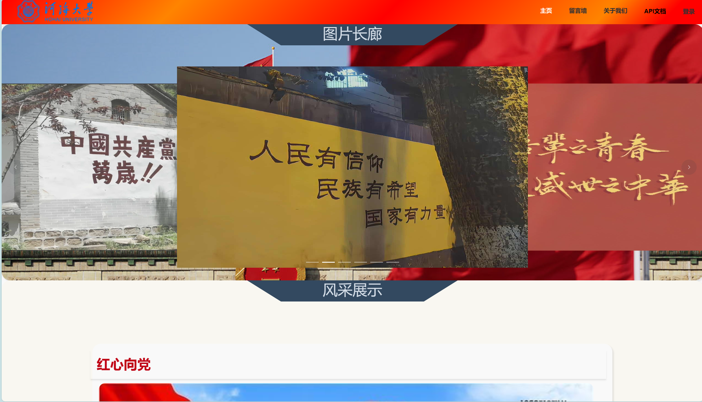
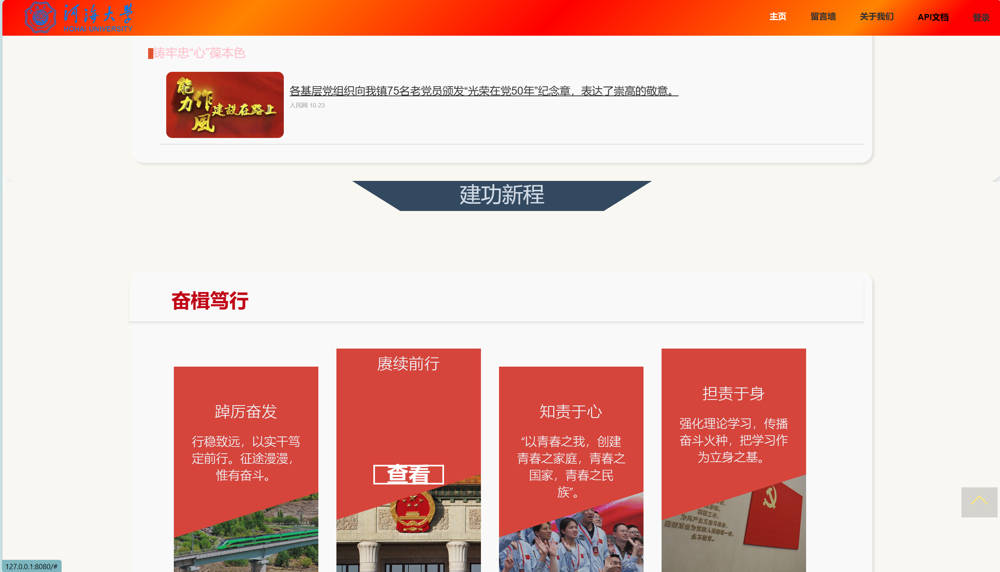
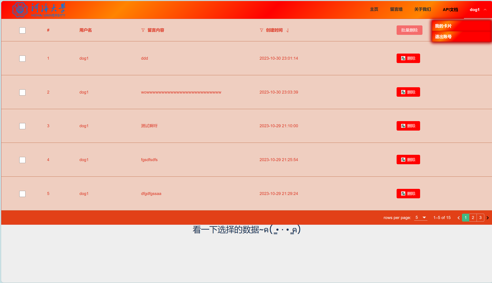
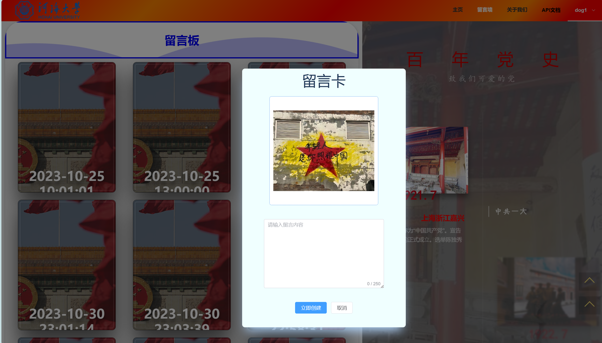

# 本项目为前后端分离的网页项目
## 前端技术栈
>  Vue3+Typescript+elementPlus(组件库)+Router(路由)+Axios(网络请求)+Pinia(状态管理)

## 后端技术栈
> Python+Flask+pymysql(数据库操作)+flagger(API文档构建)

## 数据库
> Mysql  

## 项目介绍
这是一个党建主题的网站，目前建设了如下内容及功能：  
--------------------内容--------------------
- [x] 首页
- [x] 留言墙
- [x] 关于我们

--------------------功能--------------------
- [x] 多页路由菜单栏
- [x] 留言
- [x] 党史时间轴  
- [x] 用户注册登录登出
- [x] 用户登录持久化存储 
- [x] 注册登录时对输入进行查验

- 侧边功能按钮
  - [x] 回到顶部
  - [x] 写留言
- 留言墙功能
  - [x] 用户创建留言
  - [x] 用户查看自己的留言
  - [x] 用户留言删除
  - [x] 用户留言批量删除  
## 内容展示
全部展示图片见[图片展示]()文件夹






## 项目结构
- 包含**前端后端**文件夹
  ```bash
  backend                          #  后端文件夹
  ├── Utils                        #  公共类
  │   └── utils.py                 #  公共方法
  ├── api                          #  API接口类
  │   ├── user.py                  #  用户相关API
  │   └── user_data.py             #  用户留言相关API
  ├── mySQL_config.py              #  数据库配置文件
  ├── requirements.txt             #  后端依赖
  ├── run.py                       #  启动文件
  ├── sql                          #  SQL类
  │   ├── user.py                  #  用户SQL方法
  │   └── user_data.py             #  用户留言SQL方法
  ├── sqlTableFiles                #  SQL表文件
  │   ├── user.sql                 #  用户表
  │   └── user_data.sql            #  用户留言表
  └── static                       #  静态文件
  frontend                         #  前端文件夹
  ├── package.json                 #  前端依赖
  ├── public                       #  公共资源
  ├── src                            
  │   ├── App.vue                  #  根组件
  │   ├── assets                   #  资源文件夹
  │   ├── components               #  组件文件夹
  │   ├── main.ts                  #  入口文件
  │   ├── router                   #  路由文件夹
  │   ├── stores                   #  状态管理文件夹
  │   └── views                    #  视图文件夹
  ├── tsconfig.json                #  ts配置文件
  └── vue.config.js                #  vue配置文件
  ```
## 项目运行
### 1. 安装**vue，python，mysql**,配置好环境
### 2. 从guihub克隆项目文件
```bash
git clone 'https://github.com/monthwolf/vue-flask-web.git' 
```
### 3. 安装依赖
以下命令在在**根目录**中运行
- 安装vue3框架依赖  
  ```bash
  cd frontend
  npm install
  ```
- 安装python依赖  
python依赖的安装可以在本地直接安装也可以创建虚拟环境再安装，为避免与本地python环境冲突，推荐**创建虚拟环境安装依赖**   
  - 虚拟环境安装(推荐)
    ```bash
    cd backend
    python -m venv .venv
    .venv/Scripts/activate
    pip install -r requirements.txt
    ```  
  - 本地安装
    ```bash
    cd backend
    pip install -r requirements.txt
    ```

### 4.配置数据库
- 创建数据库
  ```bash
  mysql -u root -p xxxx                           #登录自己本地的mysql数据库
  mysql> create database vue_flask_web;           #创建数据库
  mysql> use vue_flask_web;                       #切换到数据库
  mysql> source ./backend/leFiles/user.sql;       #导入用户表
  mysql> source ./backend/leFiles/user_data.sql;  #导入用户留言表
  ```
- 连接数据库  
  进入**backend**文件夹，修改**mySQL_config.py**文件
  ```python
  # 数据库连接池
  POOL = PersistentDB(
      creator=pymysql,    
      maxusage=None,      # 一个链接最多被重复使用的次数，None表示无限制
      setsession=[],      
      ping=0,             
      closeable=False,    
      threadlocal=None,   
      host='127.0.0.1',   # 数据库地址
      port=3306,          # 数据库端口号
      user='root',        # 用户名
      password='123456',  # 密码
      database='test',    # 数据库库名
      charset='utf8'      # 编码
  )


  ```

### 运行前后端项目
- **注意**:请保持数据库运行！
  ```bash
  cd backend
  python run.py
  cd ../
  cd frontend
  npm run serve
  ```